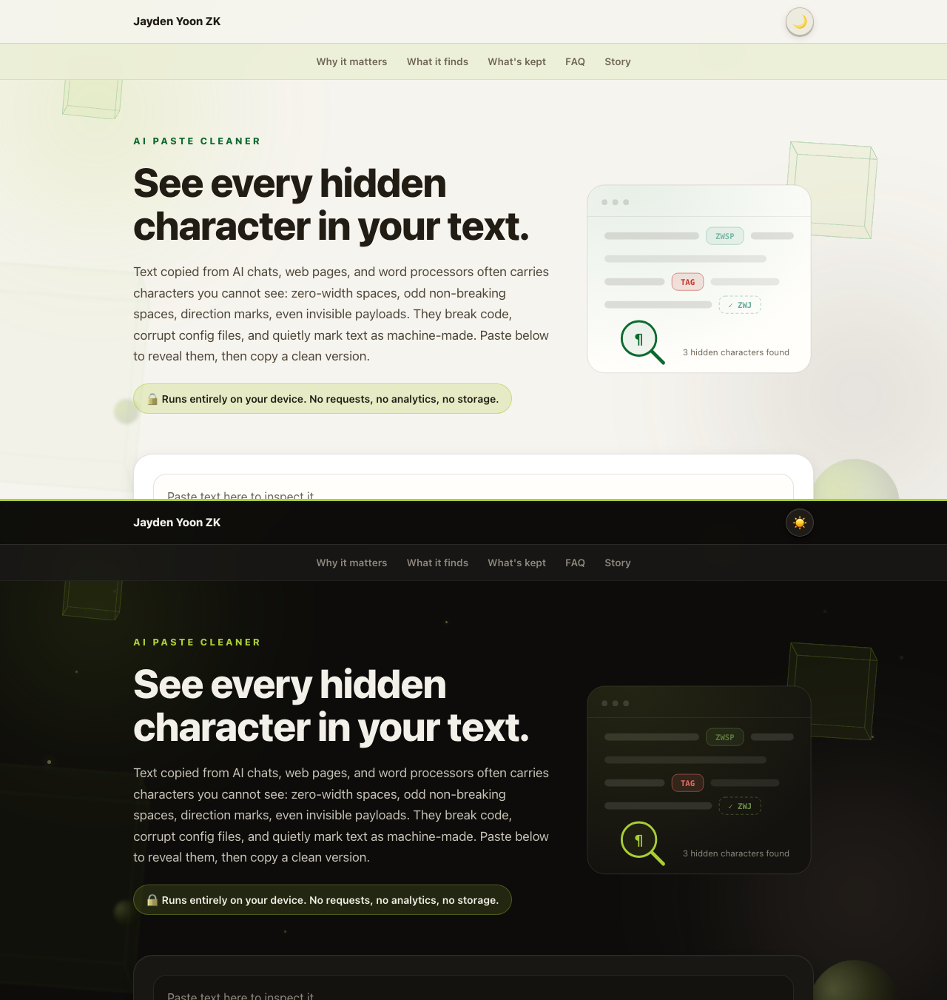

# AI Paste Cleaner

Inspect and clean the characters you cannot see: invisible Unicode, hidden tag payloads, direction overrides, mixed-script lookalikes, and punctuation that can break code or exact matching.

<p>
  <a href="https://jaydenyoonzk.github.io/ai-paste-cleaner/"></a>
  <a href="https://www.npmjs.com/package/ai-paste-cleaner"></a>
  <a href="https://github.com/JaydenYoonZK/ai-paste-cleaner/actions/workflows/ci.yml"></a>
  <a href="LICENSE"></a>
</p>

<a href="https://jaydenyoonzk.github.io/ai-paste-cleaner/?demo">
  
</a>

**[Open the live tool](https://jaydenyoonzk.github.io/ai-paste-cleaner/)** or **[jump straight to a loaded demo](https://jaydenyoonzk.github.io/ai-paste-cleaner/?demo)**. Everything runs in your browser. Your text never leaves your device.

## The problem

Text copied from chat tools, web pages, and word processors can carry characters that render as nothing or look identical to what you expect. They cause practical problems:

- A zero-width space inside a product name prevents an exact match with the visible spelling.
- A narrow no-break space (`U+202F`) looks ordinary but can make `9:30 AM` fail to equal `9:30 AM`.
- Bidirectional overrides reorder how text displays. In a filename, `exe.txt` can appear as `txt.exe` ([right-to-left override spoofing](https://attack.mitre.org/techniques/T1036/002/)). In source code, the logic a reviewer reads can differ from the logic the compiler ingests ([Trojan Source, CVE-2021-42574](https://trojansource.codes/)).
- Unicode tag characters encode ASCII-based strings without ordinary visible glyphs. Outside recognized emoji tag sequences, this tool decodes and reports them for review.
- Unicode line and paragraph separators (`U+2028`, `U+2029`) can create unexpected line boundaries and break older JavaScript source handling.
- A Cyrillic `о` inside a Latin word can bypass exact-match filters and visual review.

## What makes this cleaner different

Many strippers delete every invisible character and damage real content in the process. This one checks recognized context first:

| Kept | Why |
|---|---|
| ZWJ inside 👨‍👩‍👧 | Removing it splits the family into three people |
| ZWNJ in Persian and Hindi words | Required spelling, not noise |
| Variation selector after ❤ | Chooses emoji vs text presentation |
| Tag characters in 🏴󠁧󠁢󠁳󠁣󠁴󠁿 | Subdivision flags are built from them |
| Ideographic space in Japanese text | Standard CJK typography |
| Narrow spaces in `Bonjour !` and `« mot »` | Standard French punctuation spacing |

The inspector shows each recognized character it keeps with a dashed outline and a reason, so you can verify the decision.

## Use it in the browser

No install. Open [the tool](https://jaydenyoonzk.github.io/ai-paste-cleaner/), paste, review, copy. A service worker caches the page on your first visit, so it loads and keeps working offline afterwards (in browsers with service workers disabled, the current tab still works without a network connection).

To run the page locally:

```bash
git clone https://github.com/JaydenYoonZK/ai-paste-cleaner.git
cd ai-paste-cleaner
npm run serve   # http://localhost:8321
```

## Use it from the command line

The same engine runs on files, folders, and pipes. No dependencies, Node 22 or newer:

```bash
npx ai-paste-cleaner README.md src/
```

```
src/launch-post.md
  3:8     U+200B   ZERO WIDTH SPACE                  invisible  ->  remove
  3:27    U+202F   NARROW NO-BREAK SPACE             spaces  ->  " "

2 files scanned: 1 with findings, 2 characters to fix
```

When a hidden tag payload is present, the report decodes it on the spot (`hidden message decoded: "..."`) and a final line flags it for review.

Nothing changes on disk until you add `--write`, and the preservation rules match the browser tool exactly: emoji joiners, script shaping, flag tags, and the other recognized contexts are never touched.

**Clean your clipboard in one line.** The `-` argument reads stdin and writes cleaned text to stdout, so on macOS:

```bash
pbpaste | npx ai-paste-cleaner - | pbcopy
```

On Linux, `xclip -o -selection clipboard | npx ai-paste-cleaner - | xclip -selection clipboard`. On Windows, `Get-Clipboard | npx ai-paste-cleaner - | Set-Clipboard`.

**Gate your CI.** The scan exits `1` when it finds something to fix, `0` when clean, `2` on usage errors, so a workflow step is one line:

```yaml
- run: npx ai-paste-cleaner docs/ README.md
```

This repository gates its own documentation with the same scan [in CI](.github/workflows/ci.yml). `--json` emits a machine-readable report for pipelines, `--typography` also fixes smart quotes, em dashes, and ellipses, `--only` and `--skip` narrow the categories, and `--help` lists everything.

## Use the engine in your own project

The detection and cleaning engine is a single dependency-free ES module, the same file the browser tool and the CLI import:

```bash
npm install ai-paste-cleaner
```

```js
import { analyze, clean } from "ai-paste-cleaner";

const report = analyze(suspiciousText);
// report.findings, report.hiddenMessages, report.counts

const { text } = clean(suspiciousText, { typography: true, emDash: "comma" });
```

The engine source is [`docs/cleaner.js`](docs/cleaner.js), and the full ruleset is also published as [machine-readable JSON](docs/data/rules.json).

## Tests

```bash
npm test
```

The suite leans on the cases that are easy to get wrong: preserving emoji and Persian or Mongolian shaping, decoding malformed tag payloads, French and Japanese spacing, and staying idempotent on modifier-heavy text. It also drives the command line tool end to end, from exit codes to directory walking.

Automated checks run on Node.js 22, 24, and 26 across Linux, macOS, and Windows. The browser interface is smoke-tested by hand in Chromium. Other browsers and assistive technology are untested.

## Limits

- This is a character inspector, not an authorship detector. A finding does not prove where text came from.
- Unicode defines standardized variation sequences beyond the emoji, CJK, and Mongolian contexts recognized here. Review specialized mathematical, historical, or scholarly text before cleaning it. See the [Unicode variation-sequence FAQ](https://www.unicode.org/faq/vs.html).
- The mixed-script lookalike map is deliberately small and does not implement the full Unicode confusables dataset. Expansion is tracked in [issue #3](https://github.com/JaydenYoonZK/ai-paste-cleaner/issues/3).
- The inspector preview caps rendered marks at 20,000 to keep the page usable. Counts and cleaned output still cover the complete input.
- Clipboard buttons depend on browser permissions; manual paste and copy remain available when permission is denied.

## Contributing

Detection reports are welcome. See [CONTRIBUTING.md](CONTRIBUTING.md), or open a [false positive/negative report](https://github.com/JaydenYoonZK/ai-paste-cleaner/issues/new/choose).

For security-sensitive findings, use the private route in [SECURITY.md](SECURITY.md).

## License

MIT. Built and maintained by [Jayden Yoon ZK](https://github.com/JaydenYoonZK).
